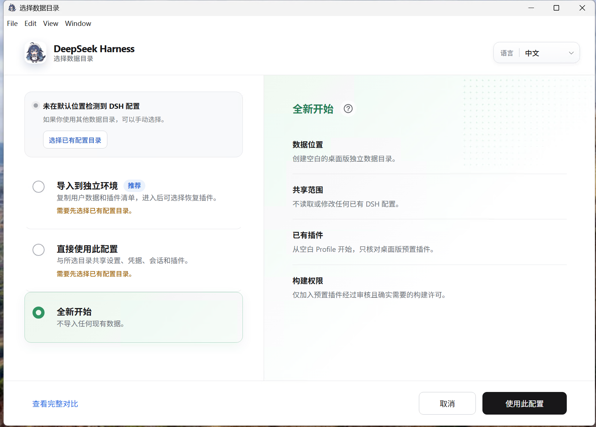
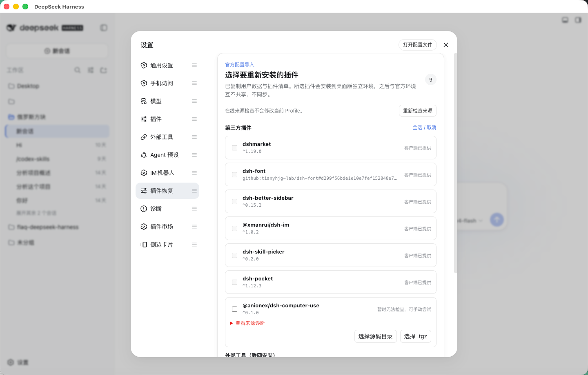
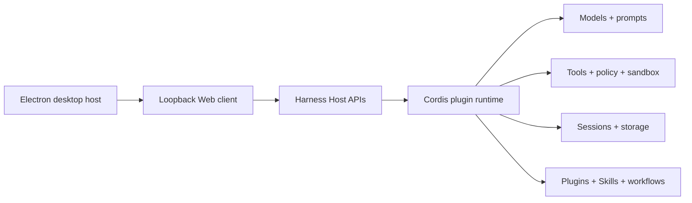

<p align="center">
  
</p>

# Open DeepSeek Harness Desktop

<p align="center">
  <strong>A ready-to-use, dependency-safe desktop edition of DeepSeek Harness</strong>
</p>

Languages: [简体中文](README.md) · English

> [!IMPORTANT]
>
> **[v1.2.0 Beta is available now — download it and give it a try](https://github.com/fenglin-dev/deepseek-harness-fenglin/releases/tag/dsh-v1.2.0).** This is a personally maintained fork based on Open DeepSeek Harness Desktop 0.1.2-alpha.1, featuring a whale-girl themed icon set, title bar overlap fix for Windows, and plugin marketplace installation/uninstallation fixes, alongside all upstream features including the Diagnostics Lab, live plugin discovery, stronger plugin isolation, and reorderable Settings navigation.
>
> This is a personally maintained beta release. Back up important configuration before upgrading, and include relevant logs or diagnostic reports when reporting problems to [this repository's Issues](https://github.com/fenglin-dev/deepseek-harness-fenglin/issues).

<p align="center">
  <a href="https://github.com/fenglin-dev/deepseek-harness-fenglin/releases"></a>
  <a href="./LICENSE"></a>
  <a href="https://github.com/flaqai/open-deepseek-harness-desktop"></a>
  <a href="https://github.com/deepseek-ai/deepseek-harness"></a>
</p>

This is a personally maintained fork of [Open DeepSeek Harness Desktop](https://github.com/flaqai/open-deepseek-harness-desktop), based on the [DeepSeek Harness](https://github.com/deepseek-ai/deepseek-harness) desktop distribution. It combines the upstream plugin-based agent runtime, Web workspace, and native desktop integration into an installable app for configuring models, running coding sessions, inspecting execution, managing plugins and Skills, and connecting external coding tools or IM bots.

Installers include Node.js, pnpm, and the Harness runtime, so users do not need to prepare a development environment. Electron does not become a second agent runtime: configuration, credentials, sessions, plugins, and Skills remain owned by the local Harness service, while Electron exposes only capability-scoped desktop integration.

> [!NOTE]
>
> This repository is a personally maintained fork, not an official DeepSeek product, and does not represent the FLAQ AI team. This version is based on [Open DeepSeek Harness Desktop](https://github.com/flaqai/open-deepseek-harness-desktop) with personal improvements and bug fixes. The project remains in beta; local data formats, plugin compatibility policies, and installation details may continue to evolve.

## Highlights in this release

- [Whale-girl themed icons](#about-this-fork): full application visual elements replaced with whale-girl themed icons.
- [Windows title bar overlap fix](#about-this-fork): fixed the window overlap issue caused by custom title bar on Windows.
- [First launch and independent data environments](#first-launch-and-independent-data-environments): import an official configuration, share a directory directly, or start fresh.
- [Plugin selection and restoration after import](#plugin-selection-and-restoration-after-import): online source checks plus safe restoration from source directories or `.tgz` archives.
- [Supercharged diagnostics](#supercharged-diagnostics): turn difficult pnpm and Cordis failures into actionable diagnoses and guarded repair.
- [Text selection and context-menu actions](#text-selection-and-context-menu-actions): copy, ask in a new conversation, or append to the current draft.
- [Desktop enhancements](#desktop-enhancements-to-the-upstream-web-experience): tray operation, quick restart, notifications, logs, in-app updates, and CLI registration.
- [Download and install](#installation): native Windows and Linux packages are available (macOS users please visit the upstream official repository).

## First launch and independent data environments

At first launch, the client checks the default official DSH data directory at `~/.dsh`. If it is absent or unsupported, users can choose another directory manually or create a clean desktop-owned environment. The chooser provides Chinese and English controls before the main Settings page is available.

### Import into an independent environment

Supported data is copied into a desktop-owned directory while the source remains unchanged. Settings, credentials, sessions, workspace information, Agent presets, Skills, and connection state can be imported.

Profiles, `node_modules`, lockfiles, plugin runtimes, bundled-plugin markers, quarantine and health records, and anonymous identifiers are not copied. Plugin configuration and a restoration list are retained, but plugin packages are installed again into the desktop Profile. After import, later changes in Desktop and the official DSH CLI/Web environment remain independent.

<p align="center">
  
  <br>
  <sub>Import into an independent environment: copy supported data and leave the source unchanged</sub>
</p>

### Use this configuration directly

Desktop can use the official `~/.dsh` directory, or another supported directory selected manually, without making a second copy. Settings, credentials, sessions, Agent presets, Skills, Profiles, and plugins are shared; later changes from Desktop or the official CLI/Web environment affect the same data.

<p align="center">
  
  <br>
  <sub>Use this configuration directly: Desktop and the selected directory share data</sub>
</p>

### Start fresh

Create an empty, desktop-owned data directory without importing existing settings, sessions, or plugins. This is suitable for first-time DSH users and for testing a clean environment.

<p align="center">
  
  <br>
  <sub>Start fresh: do not read or modify an existing DSH configuration</sub>
</p>

After entry, the setup wizard can configure a model API key, WeChat or Feishu and other IM bots, and an optional Codex connection. Every task can be skipped and completed later from Settings.

## Plugin selection and restoration after import

Importing into an independent environment copies plugin configuration and a restoration list, not the old Profile's `node_modules`. Reusing that dependency tree could carry platform-specific packages, a mismatched pnpm Store, lifecycle-script permissions, or shared Host conflicts into the new environment, so plugins are installed again in the desktop Profile.

Each entry receives a source status:

- **Provided by the client:** a bundled preset already satisfies the entry.
- **Checking:** the source is being resolved in a temporary directory without changing the active Profile.
- **Available online:** the source is valid and can be installed with the bundled pnpm.
- **Online source unavailable:** the package, repository, or Git reference does not exist; ordinary online installation is not selected by default.
- **Temporarily unknown:** the check encountered offline state, timeout, authentication failure, or rate limiting; users can retry later or explicitly attempt installation.

If an online source is unavailable, users may select a local source directory or `.tgz` archive. The client validates the package name, archive paths, manifest size, and total size. Source directories are repacked with lifecycle scripts disabled before entering the existing plugin installation flow, and a version mismatch requires a second confirmation.

Online and local restoration both continue through build approval, shared-dependency diagnostics, and quarantine when necessary. The client never scans, copies, or adopts the old `node_modules`, and it does not directly execute credential-bearing, local-path, or unrecognized dependency specifications. External tools such as Codex and Claude Code cannot be replaced with local plugin packages and remain available through **Settings → External tools**.

<p align="center">
  
  <br>
  <sub>Plugin source checks, online restoration, and guarded local restoration</sub>
</p>

## Supercharged diagnostics

Third-party plugins share the Host's Node.js process and Cordis service graph. Even code without an obvious defect can destabilize the runtime through a transitive dependency, pnpm linking behavior, or a stale Loader entry. These failures often happen before Settings or an ordinary diagnostic plugin can start, leaving users with an empty tool call, `Cannot read properties of undefined (reading 'prepare')`, a missing plugin list, or a pnpm stack that never identifies the responsible plugin.

Diagnostics therefore live in the Profile composition and boot layer rather than another ordinary plugin. Before third-party code executes, the client reads the Profile manifest, `pnpm-lock.yaml`, Workspace settings, Bundle order, installed dependency graph, and the shared runtime supplied by the current installation. It decides whether the Profile can safely enter one process before loading, repairing, or quarantining anything.

### Why identical version numbers can still conflict

Cordis Contexts, Service registrations, and parts of the tool runtime depend on object and `Symbol` identity, not only package name and version. If a plugin declares identity-sensitive Host packages such as `@deepseek-ai/cordis` or `@deepseek-ai/dsh-tools` in ordinary `dependencies`, pnpm can install another physical copy inside the Profile. Even when both copies report exactly the same version, their classes, Contexts, Services, and Symbols belong to different JavaScript module instances; a service registered through one can be `undefined` when read through the other.

The inspection therefore does not stop at `package.json`. Starting from each direct Profile plugin, it traverses the actual installed graph, records the root plugin, direct and transitive chains, declared ranges, and resolved locations, then compares the real filesystem paths of shared Host packages. Valid `peerDependencies` are not reported, while equal versions at different real paths are still recognized as an identity conflict.

### What is checked before startup

- **Shared Host singletons:** Cordis, tool runtime, attachments, LLM, system prompt, and scope-label packages must resolve to the canonical copies owned by the current Harness installation.
- **Profile and lockfile consistency:** direct dependencies, root importers, Bundle entries, and physical package directories are reconciled, including roots disabled in the manifest but retained by stale lockfiles or interrupted installs.
- **Loader and Bundle state:** orphaned Bundles, duplicates, bad order, enabled-but-unmounted entries, and ghost plugins left after uninstall are identified.
- **pnpm runtime:** Store-version mismatch, incomplete installation, blocked build scripts, missing `allowBuilds`, and peer-deduplication settings that can break linked Host-provider graphs are distinguished.
- **Lifecycle approval:** when a Git-hosted plugin genuinely requires `prepare`, only the exact dependency path reported by pnpm may be approved. Existing `false` rules win, and vague diagnostics never broaden permission automatically.
- **Version and source boundaries:** ordinary range mismatch, physical-instance conflict, temporarily unavailable sources, and truly non-convergent runtime identity failures are kept separate from network or normal plugin business errors.

### Why repair does not simply reinstall everything

The fixed order is **read-only inspection → lossless convergence → install only necessary dependencies → real-path recheck → quarantine if required**. A healthy Profile does not run pnpm just because diagnostics exist and is not reinstalled at every launch.

- Orphaned shared singletons can be relinked to the canonical Host packages owned by the currently running installation.
- When a plugin's declared range is compatible, managed `link:` overrides converge only reserved shared packages while preserving user Workspace configuration, comments, and unrelated overrides.
- Repair never lowers `minimumReleaseAge`, overrides an explicit `allowBuilds: false`, or grants arbitrary lifecycle scripts after an installation failure.
- A successful pnpm command is not sufficient. Startup continues only after shared packages resolve to one real path and Loader and dependency state agree.

### Quarantine when safe convergence is impossible

If a declared range is incompatible, repair fails, or a second shared instance remains after reinspection, only the root plugin that introduced the conflict is removed from active dependencies and Bundle order. Its original specification, version, Bundle location, complete chain, reason, and timestamp are retained; unrelated plugins and user data do not need to be reset.

Quarantine is not merely a disabled badge in the UI. It completes only after the root package is physically absent from the active Profile, shared Host packages point to canonical copies, and reinspection succeeds. Users can retry recovery or confirm uninstall from Diagnostics. Crash recovery and interrupted pnpm operations are also handled: only recorded and disabled roots are cleaned, and startup fails closed while the manifest, package tree, or shared identity remains inconsistent.

The boundary is deliberate: **inspect before plugin execution, decide from the real dependency graph and physical module identity, preserve plugins through lossless convergence where possible, quarantine only when safety cannot be demonstrated, and verify every repair before startup.** In short, pnpm and Cordis errors no longer have to read like passwords; the client tries to explain who failed, why, which protection was applied, whether it can be repaired, and what to do next.

## Text selection and context-menu actions

Selecting text in read-only conversation messages, tool output, details, or file previews opens a horizontal action bar near the selection. Right-clicking selected text opens a vertical rounded menu with icons and labels.

- **Copy:** write the selected text to the system clipboard with success or failure feedback.
- **Ask in a new conversation:** create a conversation in the current workspace and fill a localized question plus the selected text without sending it.
- **Add to the current conversation:** append the selection as a Markdown quote after the existing draft without overwriting it.

When the current session is waiting for a choice, confirmation, or answer, or when the composer cannot be edited, **Add to the current conversation** disappears. Copy and Ask in a new conversation remain available. Selections inside inputs, code editors, Settings, the sidebar, buttons, and existing menus do not trigger these actions.

<p align="center">
  <strong>Selection action bar</strong><br>
  
</p>

<p align="center">
  <strong>Rounded context menu</strong><br>
  
</p>

## Desktop enhancements to the upstream Web experience

This distribution preserves the upstream DeepSeek Harness Web client while adding desktop-specific integration and ready-to-use features.

### A complete desktop host

Electron is more than a wrapper around a Web page. The desktop host supervises the Harness child process, closes to the tray by default, waits for orderly cleanup on every true quit path, delivers system notifications, supports launch at login on macOS, exposes the log, and checks this client's releases. If Harness takes unusually long to start, the startup page offers the log while continuing to wait. Three consecutive early exits instead produce an explicit failure state with retry and log actions rather than an endless “starting” screen.

The tray can reopen the window, reveal the log, toggle notifications and launch at login, and quit safely. Abnormal exits, repeated startup failures, and recovery produce throttled native notifications. Every bridge is capability-scoped: Web content may manage these desktop preferences, reveal the fixed `harness.log`, or query this project's Releases, but it receives no generic shell, filesystem, or arbitrary-URL capability.

### Copy from the desktop client

The Electron host grants sanitized clipboard-write permission to the supervised Harness page, so message, code, and conversation copy controls work in the desktop client just as they do in the upstream Web client. Clipboard reads and unrelated browser permissions remain denied.

### Preset plugin foundation

The installer starts with the Plugin Marketplace, IM connections, Skill picker, font support, and Pocket ready to use. They remain ordinary Harness dependencies: users can uninstall them, and the desktop app respects that decision instead of silently restoring them. Connected installations retain exact npm or pinned Git identities so the market can discover later releases; integrity-checked archives provide an offline fallback. The larger Better Sidebar archive is carried by the installer and prepared only after the main interface becomes usable, with a visible non-blocking progress card.

### Dependency safety before plugin execution

Third-party plugins share the Host's Node.js runtime. One incompatible transitive dependency, orphaned Loader entry, or failed root-plugin mount can otherwise take down the whole Harness before its Settings page is available. This client adds an independent dependency-safety layer before plugin code executes: it reads the profile manifest, lockfile, Bundle order, and installation-level shared runtime, constructs the complete dependency relationship first, and only then decides which plugins may enter the current process.

- **Earlier than plugin execution:** Inspection happens before the faulty plugin is imported and mounted. Even when that plugin cannot start at all, the client can still produce a diagnosis and protect the remaining features.
- **Dependency-graph evidence, not error-string guessing:** Diagnostics expose the conflicting dependency, declared range, actual Host version, and complete reference chain, distinguishing version conflicts, orphaned Bundles, and runtime mount failures.
- **Converge first, quarantine second:** Repair first attempts to make plugins share the Host dependencies supplied by the installation. If safe convergence remains impossible, only the faulty root plugin is removed from the active profile dependencies and startup order instead of failing the whole client.
- **Fail closed and remain recoverable:** Unknown conflicts are not silently accepted, and a faulty plugin is not allowed into the live runtime. The quarantine reason and disposition remain durable, while users can retry repair or explicitly uninstall it from Diagnostics.

This capability must belong to the desktop client's boot layer rather than another ordinary diagnostic plugin. A plugin can run only after dependency resolution and Loader mounting have already succeeded, while this feature must handle failures before that point. Governing extension dependencies before extension code executes is the boundary that lets an open plugin ecosystem coexist with the stability expected by ordinary desktop users.

### User-triggered official Codex and Claude Code connections

Platform installers carry neither the official DeepSeek Harness [`@deepseek-ai/dsh-subagent-codex`](packages/subagent/subagent-codex/README.md) nor [`@deepseek-ai/dsh-subagent-claude-code`](packages/subagent/subagent-claude-code/README.md) Bundle. Onboarding and **Settings → External tools** expose explicit install actions; only after the user clicks one does the desktop client download that exact official package and its platform dependencies from npm. The action therefore requires a network connection, while the packaged runtime still supplies Node and pnpm so no system installation is required. Both connectors remain removable, and restart or upgrade never silently restores them.

The official connector currently treats every delegation as an independent, ephemeral Codex task. Codex uses the parent session's working directory and the login, model, MCP, and Skill configuration already present under the local `CODEX_HOME`, but it does not inherit the Harness conversation transcript or persist its temporary Codex thread into the Harness session. The parent receives only the final answer or a sanitized failure diagnostic; intermediate reasoning, tool traffic, raw stderr, and the complete workspace diff are not copied back.

<p align="center">
  
  <br>
  <sub>Using the connected Codex capability from a full-mode session</sub>
</p>

### External coding tools connection center

**Settings → External tools** brings Codex, Claude Code, and placeholders for future Hermes and Trae Providers into one discoverable surface. After a supported Provider is connected, existing and new full-mode sessions receive its tool at the next safe turn boundary; an already running turn is never rewritten, and minimal mode stays intentionally lean. Disconnecting withdraws the tool without deleting Harness sessions or data owned by the external product.

<p align="center">
  
  <br>
  <sub>External tools center: Codex is connected and the other Provider states remain visible</sub>
</p>

### Dynamic tool projection: connection becomes capability

Conventional Agent compositions pin tools to a particular preset: users must choose the right specialized preset in advance, while existing sessions often cannot receive a product connected later. This client treats an external-product connection as independent, durable Host capability state, then dynamically projects `subagent_codex` into each eligible Agent scope at a safe model-request boundary. Users therefore do not need to recreate a conversation or switch to a dedicated “external tools” preset: new and historical sessions both receive the currently connected capability from their next turn.

- **Turn safety:** A connection change never mutates the tool schema in the middle of a request. Connections take effect on the next turn; disconnections wait until the Agent is idle before removing the tool safely.
- **Mode isolation:** Projection is limited to full modes such as `standard`, `code`, and `cordis`; `minimal` remains lean to prevent capability inflation and accidental delegation.
- **Model discovery:** The tool and its product-specific usage guidance appear together. When a user explicitly asks to use Codex, the model is directed to call `subagent_codex` instead of guessing at or searching for a similarly named CLI through Shell.
- **Auditable state:** The external tools actually available to every model request are recorded as an `external-tools/resolved` event. Session recovery and inspection can reconstruct the capability boundary that existed then instead of guessing history from today's settings.

This design separates the conversation, Agent preset, external Provider, and model-visible tools for the current turn into four independently evolving layers. The plugin remains removable, the connection remains revocable, and historical sessions do not break when preset composition changes. The official Codex Provider still treats each delegation as an independent one-shot task: dynamic projection solves capability discovery and session lifecycle, without pretending that the official Provider already supplies persistent Codex threads.

### Preset IM bot connections

Packaged installations seed `dsh-im`, which lets users connect WeChat, Feishu, DingTalk, WeCom, QQ, Slack, Telegram, Discord, and WhatsApp from the client settings through QR codes, app manifests, or existing bot credentials. The channels share one IM management surface, with controls for switching Harness workspaces and rebinding existing sessions. Bot credentials are submitted only to the local Harness Host and managed by protected credential storage. This capability remains a removable plugin; after users remove it, the client does not silently restore it on a later launch.

### Themes and backgrounds

Switch between system, light, dark, and eight product themes; pair them with eight original built-in illustrations or replace the chat background with your own PNG, JPEG, or WebP image. Custom images remain in local browser storage and are not sent to the model. See the [theme and background reference](packages/client/ui-theme/README.md) for formats and size limits.

<table>
  <tr>
    <th width="50%">Theme settings</th>
    <th width="50%">Background settings</th>
  </tr>
  <tr>
    <td align="center"></td>
    <td align="center"></td>
  </tr>
</table>

### Based on official 0.1.2-alpha.1 — personally maintained fork v1.2.0

The current desktop baseline is based on the upstream [Open DeepSeek Harness Desktop 0.1.2-alpha.1](https://github.com/flaqai/open-deepseek-harness-desktop/releases/tag/odsh-v0.1.2-alpha.1), with this version numbered `v1.2.0 Beta`. It includes all upstream features such as folded process details, adjustable conversation width and font size, exact token usage, turn navigation, authorized subagent model selection, third-party languages, the improved image pipeline, expanded ACP support, and more efficient page and conversation initialization, plus personally maintained improvements including whale-girl themed icons, Windows title bar overlap fix, and plugin marketplace issue fixes. Existing file and Session references, concurrent `web_search`, reasoning passback, persistent PowerShell PTY, dynamic client packages, build Profiles, and branding slots remain available. Upstream also fixes Windows paths containing Chinese characters, persistent terminal output on macOS and Linux, lost Agent Preset directories, and idle WebSocket disconnects. Electron always passes `--no-open` to `dsh web`, so launching the desktop app does not also open a system browser.

### Diagnostics Lab

The source-only **Install diagnostic test plugin** action has been replaced by a production Diagnostics Lab available in development and installed builds. Its isolated offline catalog exercises shared-Host shadow copies, orphaned Bundles, missing modules, invalid patches, duplicate Loader entries, lifecycle failures, blocked build approval, and interrupted repair while showing the complete inject, detect, repair, verify, and cleanup timeline.

Quick, standard, and soak presets run 1, 3, or 10 rounds. The default target never changes the user's Profile. The advanced active-Profile target requires a second confirmation, pauses Harness, records managed-file hashes and a recovery journal, then restores and reinspects after every round. If clean recovery cannot be proven, Profile plugins do not restart. Every run produces redacted JSON and text reports without usernames, local paths, or credentials.

## What you can do

- Connect to DeepSeek by default or configure a compatible API base URL, API key reference, and custom model identifiers from onboarding or Settings.
- Open local workspaces, create persistent sessions, stream agent responses, copy messages, remove sessions, and clear conversation history.
- Review model-visible execution records and concise key-step summaries so important tool activity is easier to confirm.
- Invoke Skills and extend the product through Cordis plugins.
- Connect Codex or Claude Code from one surface so full-mode sessions can delegate independent coding tasks to official product subagents.
- Check the fixed official upstream for stable Harness changes and perform a guarded clean fast-forward update from desktop source runs.

## Installation

Download builds only from this project's [GitHub Releases](https://github.com/fenglin-dev/deepseek-harness-fenglin/releases) page. [`v1.2.0 Beta`](https://github.com/fenglin-dev/deepseek-harness-fenglin/releases/tag/dsh-v1.2.0) provides the following artifacts:

| Platform | Architecture | Release package | Status |
| --- | --- | --- | --- |
| Windows | `x64` | `DeepSeek-Harness-windows-x64.exe` | Available |
| Linux | Debian / Ubuntu (`x64`) | `DeepSeek-Harness-linux-x64.deb` | Available |
| Linux | Fedora / RHEL (`x64`) | `DeepSeek-Harness-linux-x64.rpm` | Available |

> [!NOTE]
>
> This personally maintained fork currently provides only Windows and Linux installers, not macOS. Users who need macOS please visit the [upstream official repository](https://github.com/flaqai/open-deepseek-harness-desktop/releases).

The Release also includes `SHA256SUMS`. Verify downloads before installation; only files actually present on this project's Releases page are public release artifacts.

### Windows

Download and run the Windows x64 installer. Windows may display a reputation-based warning for an unsigned or newly published build; continue only after checking the repository and release checksum. During an upgrade, the installer detects only the real client executable and bundled runtime processes, avoiding false matches against similarly named directories or unrelated Node processes.

> [!IMPORTANT]
>
> Installing plugins from GitHub repositories requires [Git](https://git-scm.com/download/win) to be installed on your system. Regular users who do not need to install GitHub source-type plugins can ignore this requirement. This issue has been reported to the plugin marketplace developers.

### Linux

Install the package matching your distribution:

```bash
# Debian / Ubuntu
sudo apt install "/path/to/DeepSeek-Harness-linux-x64.deb"

# Fedora / RHEL
sudo dnf install "/path/to/DeepSeek-Harness-linux-x64.rpm"
```

<a id="run"></a><a id="run-from-source"></a>

## Quick start

Install Node.js `^22.19.0 || >=24.0.0` and pnpm `11.7.0`, then run:

```sh
git clone https://github.com/fenglin-dev/deepseek-harness-fenglin.git
cd deepseek-harness-fenglin
pnpm install
pnpm run build
pnpm run dev:desktop
```

The desktop host starts a local Harness process and opens its loopback Web UI in a hardened Electron window. To run only the Web client from the same checkout:

```sh
pnpm dsh web
```

Source Web uses the current `DSH_HOME`, normally the official `~/.dsh` when unset. Installed Desktop uses the data directory selected at first launch, so whether Web and Desktop share data depends on that choice rather than the interface itself.

See the [desktop application reference](apps/desktop/README.md) for environment overrides, process supervision, update behavior, and current limitations. The [Web UI guide](docs/user/guide/index.md) covers the browser workflow.

`pnpm run build` prepares the repository artifacts. `pnpm dsh web` uses those built artifacts without rebuilding. The Web command starts at `http://127.0.0.1:3080` and opens the default browser for a local launch. Pass `--no-open` to keep it server-only; the Electron host always uses this mode.

## Architecture



DeepSeek Harness follows an **everything is a plugin** architecture powered by [Cordis](https://github.com/cordiverse/cordis). The desktop window does not become a second runtime: configuration, credentials, sessions, plugins, and Skills remain owned by Harness services. Start with the [architecture documentation](docs/architecture.md) and [development guide](docs/development.md) before changing packages.

## Plugins and Skills

The home and Settings surfaces expose plugin discovery and supported installation actions. Registry installation uses validated package specifications, explicit confirmation, streamed command output, and a restart-required result; it is not a generic shell prompt. Add the [`dsh-plugin`](https://github.com/topics/dsh-plugin) topic to a compatible plugin repository so users can find it.

Skills remain managed through Harness providers and are invoked in the same session context as the rest of the agent. Plugin authors should use documented service definitions, providers, consumers, effects, and configuration instead of Electron-only state. Shared Host packages must be declared as `peerDependencies` to avoid installing a second Cordis or DSH runtime instance inside the Profile.

## Security and privacy

The renderer runs with Node integration disabled, context isolation enabled, and Chromium sandboxing enabled. Navigation is restricted to the exact loopback Harness origin, renderer permission requests are denied, and no generic command or filesystem bridge is exposed to Web content.

API keys remain owned by the Harness credentials service. Do not commit credentials. Before selecting any compatible provider, review its endpoint, model support, tool-calling behavior, pricing, rate limits, and data-handling terms.

## Free API-token options for evaluation

Users who want to try Harness before purchasing model credits can evaluate these OpenAI-compatible options. They are independent third-party services, are not bundled or selected by default, and may change their free quotas, model names, rate limits, logging policies, or availability at any time.

- **[Agnes AI](https://agnes-ai.com/)** — offers an API-key application and free-access entry for its multimodal gateway. Add it as an OpenAI-compatible provider with Base URL `https://apihub.agnes-ai.com/v1`; `agnes-2.5-flash` is the current general choice for coding, reasoning, tool calling, and Agent workflows. Confirm the account's current Token Plan and limits in the Agnes console before relying on it.
- **[OpenRouter · Ox Alpha](https://openrouter.ai/stealth/ox-alpha?view=api)** — use Base URL `https://openrouter.ai/api/v1` and model ID `stealth/ox-alpha`. Its current catalog price is zero for input and output tokens, but stealth/alpha models are previews and may be renamed, withdrawn, rate-limited, or repriced. OpenRouter's account-level free-model limits still apply.

Create keys only on the providers' official sites and save them through Harness credentials. Never paste API tokens into issues, screenshots, README files, or committed configuration.

## Project direction

- Improve plugin and Skill discovery, compatibility metadata, lifecycle management, and update visibility.
- Build on the existing tray, notifications, and startup diagnostics with native approvals, richer task status, deep links, and an authenticated local control endpoint.
- Improve interactive approval, progress, change summaries, and resumable sessions for external coding tools while keeping the Harness and product context boundaries explicit.
- Continue strengthening identity mapping, authorization, audit events, rate limits, and revocation for the preset IM bot connections.
- Continue real Windows 10/11 and mainstream Linux validation for this personally maintained fork (macOS users please use the upstream official version).

These items describe direction, not completed support. See the [desktop release matrix](apps/desktop/README.md#cross-platform-release-matrix) for the current implementation boundary.

## Documentation and community

- Read the [user guide](docs/user/guide/index.md), [plugin introduction](docs/user/develop/framework/index.md), and [Skill guide](docs/subsystems/skills.md).
- Use [GitHub Issues](https://github.com/fenglin-dev/deepseek-harness-fenglin/issues) for reproducible bugs and feature requests.
- Discuss the upstream runtime in [DeepSeek Harness Discussions](https://github.com/deepseek-ai/deepseek-harness/discussions) or its [Discord community](https://discord.gg/Ycq5dCaS4).
- See [CONTRIBUTING.md](CONTRIBUTING.md) before contributing and [AGENTS.md](AGENTS.md) when working with coding agents in this repository.

## Acknowledgements

Special thanks to the original authors of [Open DeepSeek Harness Desktop](https://github.com/flaqai/open-deepseek-harness-desktop), the [FLAQ AI team](https://flaq.ai/) and [hecooc](https://github.com/hecooc). This fork is based on their excellent work and is personally maintained with improvements and bug fixes.

Thank you to the [DeepSeek Harness](https://github.com/deepseek-ai/deepseek-harness) maintainers for the official Codex and Claude Code Providers, and to [OpenAI Codex](https://github.com/openai/codex) and [Anthropic Claude Code](https://github.com/anthropics/claude-code) for their product runtimes. This project integrates user-triggered npm installation of those official connectors with the desktop connection center.

### Recommended plugins

The following three plugins have been tested and are recommended for installation:

- **[`dsh-market`](https://github.com/dsh-market/dsh-market)**: Plugin marketplace for browsing, searching, installing, and managing plugins inside Harness — the foundation for extending functionality.
- **[`dsh-im`](https://github.com/xmanrui/dsh-im)**: Connects nine IM bot channels including WeChat and Feishu, allowing Harness to receive and reply to messages through instant messaging tools.
- **[`dsh-skill-picker`](https://github.com/a735624258/dsh-skill-picker)**: Quickly select a Skill from the composer and insert the Harness Skill invocation, improving usage efficiency.

Thank you to the authors and maintainers of these community plugins. The startup set is removable, while the larger Better Sidebar remains an explicit install:

- [`dsh-im`](https://github.com/xmanrui/dsh-im), maintained by [xmanrui](https://github.com/xmanrui): connects nine IM bot channels, including WeChat and Feishu.
- [`dsh-skill-picker`](https://github.com/a735624258/dsh-skill-picker), maintained by [a735624258](https://github.com/a735624258): selects a Skill from the composer and inserts the Harness Skill invocation.
- [`dsh-market`](https://github.com/dsh-market/dsh-market), maintained by the [dsh-market](https://github.com/dsh-market) community: browses, searches, installs, and manages plugins inside Harness.
- [`dsh-font`](https://github.com/tianyhjg-lab/dsh-font): provides client font customization from a pinned Git revision.
- [`dsh-pocket`](https://github.com/shaobeichen/dsh-pocket): provides the Pocket extension included in the startup set.
- [`DSH Better Sidebar`](https://github.com/omdsh-dev/DSH-better-sidebar): provides the optional enhanced sidebar installed only on request.

## About this fork

This repository is a personally maintained fork of [Open DeepSeek Harness Desktop](https://github.com/flaqai/open-deepseek-harness-desktop), based on the upstream official version with personal improvements and bug fixes.

### Main improvements in this version

- **Whale-girl themed icons**: All application visual elements replaced with whale-girl themed icons, including app icon, tray icon, and installer icon.
- **Windows title bar overlap fix**: Fixed the window overlap issue caused by custom title bar on Windows platform.
- **Plugin marketplace installation/uninstallation fixes**: Fixed and reported issues encountered during plugin installation and uninstallation processes.
- **CI configuration optimization**: Adapted to the personally maintained build environment, providing only Windows and Linux installers.

### About the upstream original authors

[FLAQ.AI](https://flaq.ai/) is the original team behind [Open DeepSeek Harness Desktop](https://github.com/flaqai/open-deepseek-harness-desktop), providing unified API access to image, video, music, and language models for AI Agents and production applications, together with documentation and developer-oriented workflows. This desktop project comes from their recurring work around model integration, local Agent environments, plugin delivery, and cross-platform application packaging.

Related upstream open-source projects include [Backlink Skills](https://github.com/flaqai/backlink_skills), [Awesome Codex Skills](https://github.com/flaqai/awesome_codex_skills), and [Awesome Claude Code Skills](https://github.com/flaqai/awesome_claude_code_skills).

FLAQ.AI remains an optional compatible provider or companion platform. It is not required to run this repository, is not configured as a hidden default, and does not imply endorsement by DeepSeek. Provider capabilities, availability, and commercial terms can change, so confirm current details in the [FLAQ.AI documentation](https://flaq.ai/docs/) before production use.

> [!NOTE]
>
> This fork is maintained by an individual developer and does not represent the FLAQ AI team or DeepSeek official. For issues with this fork, please submit to [this repository's Issues](https://github.com/fenglin-dev/deepseek-harness-fenglin/issues). For upstream-related issues, please submit to the [official repository](https://github.com/flaqai/open-deepseek-harness-desktop/issues).

## License

Open DeepSeek Harness Desktop is available under the [MIT License](LICENSE). Third-party dependencies and their licenses are disclosed in [THIRD_PARTY_NOTICES.md](THIRD_PARTY_NOTICES.md).

## Friends

- [DSHFind](https://dshfind.com/zh) — a Chinese DeepSeek Harness learning and sharing community with tutorials, plugins, and community resources.
