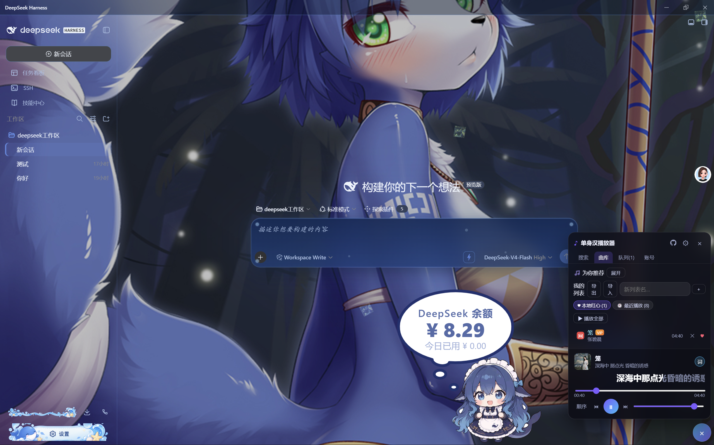

# DeepSeek Harness 修复版

> 本项目基于 [flaqai/open-deepseek-harness-desktop](https://github.com/flaqai/open-deepseek-harness-desktop) 修改，已获得原作者同意。
>
> 原项目链接：https://github.com/flaqai/open-deepseek-harness-desktop

## 预览

| 鲸鱼女孩图标 | 软件界面 |
|:---:|:---:|
|  |  |

## 简介

DeepSeek Harness 是一个开源的 DeepSeek 桌面客户端，本仓库在原版基础上修复了多个 bug，并替换了图标。

## 修复内容

### 1. 顶部窗口遮挡修复

**问题：** 程序顶部标题栏遮挡下方 DeepSeek UI 内容。

**修复：** 修改 `resources/app.asar` 中的窗口配置，调整标题栏位置。

**修改文件：** `patches/app.asar`

---

### 2. 鲸鱼女孩图标替换

**问题：** 原版图标不够美观。

**修复：** 替换 exe 图标、资源文件图标、托盘图标为鲸鱼女孩图标。

**修改文件：** `patches/icon.ico`

---

### 3. 插件市场安装 URL tarball 插件失败

**错误信息：**
```
ERR_PNPM_MISSING_TARBALL_INTEGRITY: Cannot install package "xxx@https://gh-proxy.com/.../tar.gz/xxx":
its lockfile entry has no "integrity" field, so pnpm cannot verify the downloaded tarball.
```

**根本原因：**
- pnpm 11+ 要求 URL tarball（GitHub codeload / gh-proxy）的 lockfile 条目必须包含 `integrity` 字段
- GitHub codeload tarball 不提供 integrity，导致 pnpm 拒绝安装
- 之前安装过同一插件后，pnpm-lock.yaml 中会留下一条没有 integrity 的记录，导致后续每次安装都失败

**修复方案：**
在执行 `dsh plugin add` 之前，检测目标是否为 URL tarball（以 `http://` 或 `https://` 开头，包含 `.tar.gz` 或 `.tgz`）。如果是，则自动删除 profile 目录中的 `pnpm-lock.yaml`，让 pnpm 从新下载的 tarball 重新生成 lockfile。

修复同时覆盖了两条执行路径：
- `runDshPlugin`（CLI 路径）
- `createDesktopPluginRuntime` 中的 `runPlugin`（Desktop 路径）

> 该修复已向上游提交 PR：[dsh-market/dsh-market#415](https://github.com/dsh-market/dsh-market/pull/415)

**修改文件：** `patches/dshmarket/lib/dsh-cli.js`

---

### 4. 卸载插件后不提示刷新页面

**问题：**
- 启用/关闭插件会提示"刷新页面"
- 卸载插件后不提示刷新，导致插件已卸载但由于缓存原因仍在界面上运行

**修复方案：**
- 后端：在卸载路由的响应中添加 `refresh: true` 字段（当被卸载的插件有 client 部分时），与启用/关闭插件的行为保持一致
- 前端：在卸载处理函数中处理 `refresh` 字段，当为 true 时将插件加入待刷新列表（显示与启用/关闭相同的刷新提示横幅），而不是清除它

**修改文件：**
- `patches/dshmarket/lib/routes.js`
- `patches/dshmarket/client/client.js`

---

## 推荐插件

以下插件在修复版中测试通过，推荐搭配使用：

### 🐋 鲸鱼挂件插件

**DeepSeek-Balance-Whale-Widget** - 桌面鲸鱼挂件，显示余额等信息。

- 仓库：https://github.com/MeteorNOX/DeepSeek-Balance-Whale-Widget

### 🎨 皮肤插件

**dsh-web-ui-all** - 全套 UI 皮肤包，包含多种主题样式。

- 仓库：https://github.com/zhu1090093659/dsh-web/tree/main/packages/dsh-web-all#readme

### 🎵 播放器插件

**SinglePlayer** - 内置音乐播放器，支持网易云音乐等音源。

- 仓库：https://github.com/nxz1026/SinglePlayer

---

## 仓库结构

```
deepseek-harness-patched/
├── README.md                          # 本说明文档
├── BUILD.md                           # 构建说明（如何从原版构建修复版）
├── .gitignore                         # Git 忽略文件
├── assets/                            # 预览图片
│   ├── icon-preview.png               # 鲸鱼女孩图标预览
│   └── screenshot.png                 # 软件界面截图
├── patches/                           # 修复补丁目录
│   ├── app.asar                       # 修复后的 app.asar（顶部窗口遮挡修复）
│   ├── icon.ico                       # 鲸鱼女孩图标
│   └── dshmarket/                     # dshmarket 插件市场修复
│       ├── lib/
│       │   ├── dsh-cli.js             # URL tarball 安装修复 + lockfile 清理
│       │   └── routes.js              # 卸载刷新提示修复
│       └── client/
│           └── client.js              # 前端刷新提示修复
├── scripts/
│   ├── apply-patches.ps1              # 一键应用补丁到已安装的程序
│   └── build-installer.ps1            # 构建自解压安装包
├── installer/
│   └── Installer.cs                   # 自解压安装程序源代码（C# / .NET Framework 4.x）
└── docs/
    └── CHANGES.md                     # 修改记录
```

## 使用方法

### 方法一：使用预编译安装包（推荐）

下载 `DeepSeek-Harness-Setup.exe`，双击运行，选择安装目录，点击安装即可。

安装包会自动：
1. 解压程序文件（包含顶部窗口修复 + 图标替换）
2. 应用 dshmarket 插件市场修复
3. 创建桌面快捷方式

### 方法二：手动应用补丁

如果已经安装了原版 DeepSeek Harness，可以手动应用补丁：

```powershell
# 1. 替换 app.asar
Copy-Item "patches\app.asar" "C:\Program Files\DeepSeek Harness\resources\app.asar" -Force

# 2. 替换 dshmarket 修复文件
$dshmarketDir = "$env:APPDATA\open-deepseek-harness-desktop\dsh-home\profiles\web\node_modules\dshmarket"
Copy-Item "patches\dshmarket\lib\dsh-cli.js" "$dshmarketDir\lib\dsh-cli.js" -Force
Copy-Item "patches\dshmarket\lib\routes.js" "$dshmarketDir\lib\routes.js" -Force
Copy-Item "patches\dshmarket\client\client.js" "$dshmarketDir\client\client.js" -Force

# 3. 替换 exe 图标（需要 Resource Hacker）
# 参考 scripts/replace-icon.ps1
```

然后重启 DeepSeek Harness。

### 方法三：使用一键应用脚本

```powershell
# 以管理员身份运行 PowerShell
.\scripts\apply-patches.ps1
```

脚本会自动检测安装目录并应用所有补丁。

## 从源码构建

详见 [BUILD.md](BUILD.md)。

## 验证方法

1. **顶部窗口**：程序顶部标题栏不应遮挡下方 UI
2. **图标**：exe、快捷方式、托盘、窗口图标均为鲸鱼女孩图标
3. **安装 URL tarball 插件**：在插件市场安装 SinglePlayer 等 GitHub 源插件，应不再报 `ERR_PNPM_MISSING_TARBALL_INTEGRITY`
4. **卸载插件**：卸载插件后应弹出"刷新页面"提示
5. **重新安装**：卸载后重新安装同一插件，应不再报 lockfile 相关错误

## 兼容性

- 操作系统：Windows 10 / 11（x64）
- .NET Framework：4.x（安装程序运行时）
- DeepSeek Harness：桌面版（open-deepseek-harness-desktop）

## 已知限制

- 部分昼夜更替主题不支持（兼容性问题，非本修复范围）
- 安装程序仅支持 Windows
- dshmarket 目录不存在时（首次安装未运行过程序），需先运行一次程序再应用补丁

## 致谢

- 原项目：[flaqai/open-deepseek-harness-desktop](https://github.com/flaqai/open-deepseek-harness-desktop)
- 图标来源：deepseek-whale-girl-icon
- dshmarket 插件市场：[dsh-market/dsh-market](https://github.com/dsh-market/dsh-market)
- 推荐插件：
  - [DeepSeek-Balance-Whale-Widget](https://github.com/MeteorNOX/DeepSeek-Balance-Whale-Widget) by MeteorNOX
  - [dsh-web-ui-all](https://github.com/zhu1090093659/dsh-web/tree/main/packages/dsh-web-all#readme) by zhu1090093659
  - [SinglePlayer](https://github.com/nxz1026/SinglePlayer) by nxz1026

## 许可证

本项目基于原项目许可证发布，修改部分遵循相同许可证。
